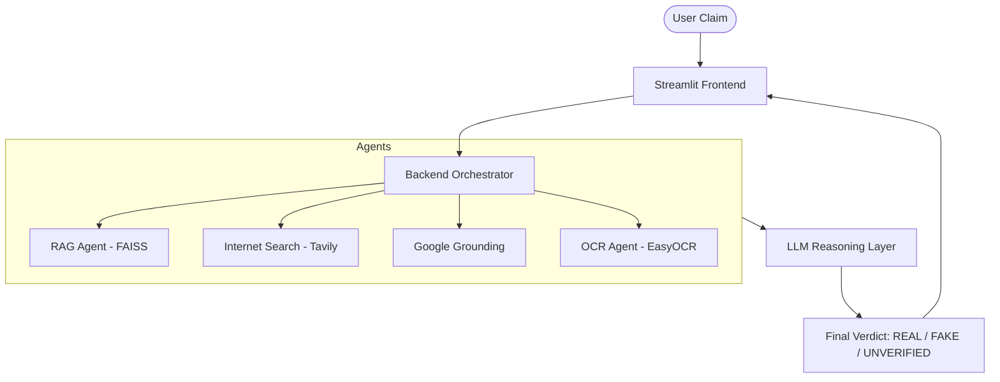

# 🤖 FactCheck AI

**FactCheck AI** is a state-of-the-art, ChatGPT-style chatbot designed to verify claims using a multi-agentic workflow. It combines internal knowledge, real-time internet search, and authoritative grounding to provide accurate verdicts on any given claim.

---

## ✨ Key Features

- **Hybrid Analysis**: Combines Retrieval-Augmented Generation (RAG), live internet search, and Google Grounding.
- **Multi-Agentic Core**:
  - 🏠 **RAG Agent**: Checks the internal knowledge base for previously verified info.
  - 🌐 **Internet Search Agent**: Uses Tavily to fetch fresh information from the web.
  - 🔍 **Google Grounding Agent**: Cross-references claims with live Google search results.
  - 🖼️ **OCR Agent**: Extracts text from images or PDFs for instant fact-checking.
- **Modern UI**: A sleek, dark-themed interface built with Streamlit, featuring a collapsible sidebar and responsive chat UI.
- **Multi-Model Support**: Switch between specialized LLMs from **Groq** and **Google** (Gemini).
- **Traced Execution**: All agent steps are automatically traced via **LangSmith** for transparency and debugging.

---

## 🏗️ Architecture



---

## 🚀 Getting Started

### Prerequisites

- Python 3.10+
- API Keys for:
  - [Groq](https://console.groq.com/)
  - [Google AI (Gemini)](https://aistudio.google.com/)
  - [Tavily](https://tavily.com/)
  - [LangSmith](https://smith.langchain.com/)

### Installation

1. **Clone the repository**:
   ```bash
   git clone <repository-url>
   cd FACTCHECKAI
   ```

2. **Setup the Backend**:
   ```bash
   cd backend
   python -m venv .venv
   source .venv/bin/activate  # On Windows: .venv\Scripts\activate
   pip install -r requirement.txt
   ```

3. **Configure Environment Variables**:
   Create a `.env` file in the `backend/` directory using `.env.example` as a template:
   ```env
   GROQ_API_KEY=your_groq_key
   GOOGLE_API_KEY=your_google_key
   TAVILY_API_KEY=your_tavily_key
   LANGCHAIN_API_KEY=your_langsmith_key
   ```

### Running the App

1. **Start the Streamlit Frontend**:
   ```bash
   cd ../frontend
   streamlit run app.py
   ```

---

## 🛠️ Tech Stack

- **Frontend**: Streamlit, Custom CSS
- **Orchestration**: LangChain, LangGraph
- **Knowledge Base**: FAISS (Vector DB), Sentence Transformers
- **OCR**: EasyOCR, PyMuPDF
- **LLMs**: Groq (Llama), Google Gemini
- **Monitoring**: LangSmith

